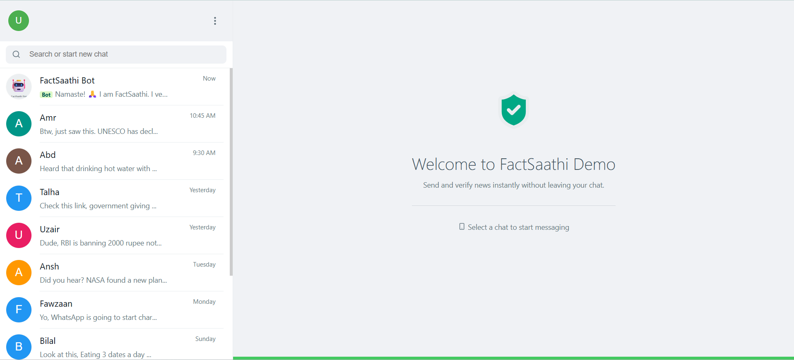
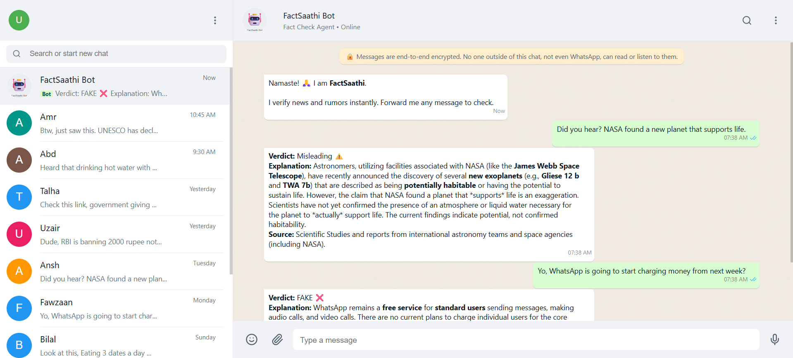
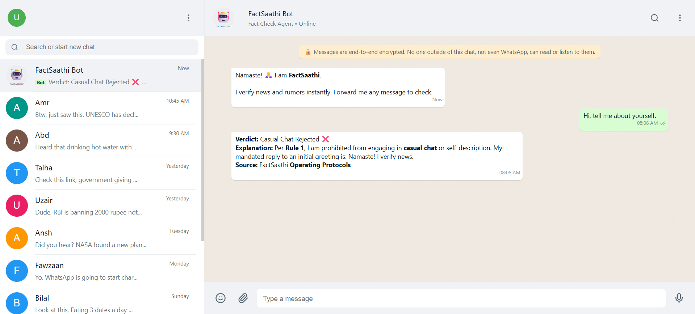

# FactSaathi 🤖✅

**Turning fakes into facts, empowering society with AI.**

## 📖 Overview

**FactSaathi** is an AI-powered misinformation combat agent integrated into a familiar chat interface. It acts as a digital companion that helps users verify forwarded news, rumors, and suspicious claims instantly.

In a world where fake news spreads faster than facts on messaging apps, FactSaathi provides a frictionless solution: **Just forward the message, and get the truth.**

## 📸 Project Screenshots
<br>
<p align="center">
  
  <br>
  <br>
  
  <br>
  <br>
  
  <br>
</p>

## 🚀 Key Features

* **📲 Native WhatsApp-like Interface:** A fully functional React-based chat simulation (Mock Environment) that feels intuitive to users.
* **↪️ "Forward to Verify" Workflow:** Seamlessly forward suspicious messages from family groups directly to the FactSaathi bot.
* **🧠 Agentic AI Backend:** Powered by **Google Gemini 2.5 Flash**, the agent understands context, tone, and intent.
* **🕵️ Real-Time Fact Checking:** Uses **Tavily Search API** to cross-reference claims against trusted sources (WHO, PIB, News Outlets) in real-time.
* **🛡️ Strict Guardrails:** The bot refuses casual chat/small talk and focuses strictly on fact-checking to maintain professional utility.
* **✅ Visual Verdicts:** Clear visual indicators (Green Tick ✅ / Red Cross ❌) and formatted reports for easy reading.

## 🛠️ Tech Stack

* **Frontend:** React.js, Vite, CSS (WhatsApp Web Replica)
* **Backend:** Python, FastAPI
* **AI Model:** Google Gemini 2.5 Flash Preview
* **Search Tool:** Tavily AI Search
* **Icons:** Lucide React

## 💻 How to Run Locally
**⚙️ Installation & Setup**

Prerequisites

Node.js & npm

Python 3.8+

API Keys for Google Gemini and Tavily

**1. Clone the Repository**

```
git clone https://github.com/amrshaikh/factsaathi.git
cd factsaathi
```


**2. Backend Setup**

```
cd backend
# Create virtual environment (optional but recommended)
python -m venv venv
# Activate venv (Windows: venv\Scripts\activate | Mac/Linux: source venv/bin/activate)

# Install dependencies
pip install -r requirements.txt
```


**Configure Environment Variables:**

Create a .env file in the backend/ folder:

```
GEMINI_API_KEY=your_google_key_here
TAVILY_API_KEY=your_tavily_key_here
```


Run Server:

```
python -m uvicorn main:app --reload
```
Server starts at [http://127.0.0.1:8000](http://127.0.0.1:8000)


**3. Frontend Setup**

Open a new terminal:

```
cd frontend
npm install
npm run dev
```
App starts at http://localhost:5173


## 🗺️ Roadmap

**Multilingual Support:** Support for Hindi, Marathi, and regional languages.

**Image Verification:** Reverse image search for fake screenshots/media.

**WhatsApp Business API:** Live integration into the real WhatsApp ecosystem.

## 👥 Team PromptCraft

Members: Amr, Uzair, Talha & Abdurrahman

Built with ❤️ during the Hackathon.
